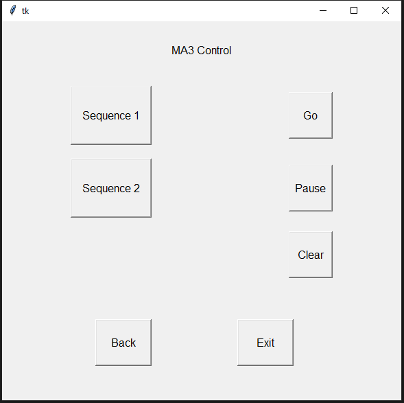

<h1 align="center">
  Backlog 1 Sprint 1
</h1>
<p align="center">

 <i align="center">Prepping Raspberry Pi , Open Sound Control & Creation of Grapgical User Interface </i>

 </p>

 # Summary:
In this sprint of Backlog 1 , here are the following tasks:


1.  Preparing & Installing OSC on Raspberry Pi
2.  Raspberry Pi to Raspberry Pi OSC Communication
3.  Create a UI via tkinter
4.  OSC Communication to GrandMA3 & Yamaha QL1
 


# Prepping Raspberry Pi:
<details><summary><b>Show Preparation</b></summary>
**[Huats Club - rpistarterkit](https://github.com/huats-club/rpistarterkit)**

<br>
After you are done setting up, Please follow these steps to create a Virtual Environment:

# Prepping Virtual Environment:

1. To install **Python Virtualenv**

```
sudo apt install virtualenv python3-virtualenv -y
```

2. To create a new virtual environment

```
virtualenv -p /usr/bin/python3 <environment_name>
```
**Note** - the virtual environment will be a folder

3. To activate virtual environment

```
source <environment_folder>/bin/activate
```

4. To install a package

```
pip3 install python-osc
```

5. To deactivate environment

```
deactivate
```

## To copy virtual environment

1. Generate dependencies file

```
pip3 freeze > requirements.txt
```

This will generate a requirement file at the current working directory.

2. To install dependencies in new enviroment

```
source <environment_folder>/bin/activate
```

```
pip3 install -r ~/<directory>/requirements.txt
```
## References
1. Using and Copying virtual environment: Click [here](https://github.com/huats-club/mts_sensor_cookbook/blob/main/0.%20virtual_environment/venv.md).

# Installing Python-OSC on Raspberry Pi:
**Python-osc** is a Python library for sending and receiving **Open Sound Control (OSC)** messages. OSC is a protocol for communication among computers, sound synthesizers, and other multimedia devices that is widely used in the field of electronic music and multimedia applications.

Python-osc provides a convenient way to work with OSC in Python by offering functions and classes for creating OSC messages, handling OSC bundles (a collection of OSC messages), and establishing OSC communication between different devices or software applications. It supports both OSC over UDP (User Datagram Protocol) and OSC over TCP (Transmission Control Protocol) for network communication.

### To Install Python-OSC
**On Raspberry Pi**
```
pip3 install python-osc==1.8.1
```
</details>

# Pi to Pi Communication via OSC:
<details><summary><b>Show Pi-Pi</b></summary>
Sample code is located under the `Backlog 1 Sprint 1` folder. 

## System Flowchart 


### Instructions
 
1.  Identify the IP address of the Raspberry Pi Server, in this particular case, **RPi A**. Type the following command on the terminal of **RPi A**.
```
ifconfig
```

If you are using **Ethernet Connection**, identify the *IP address* under the `eth0` section.

If you are using **WiFi Connection**, identify the *IP address* under the `wlan0` section. 

2. Edit the server IP address `receiver_ip` (*line 4*) in `osc_server.py` file (**RPi A**)

Open and edit `osc_server.py` (please make sure you are in the correct directory)
```
nano osc_server.py
```

Enter corresponding **IP Address** retrieved in **Step 1** into `line 4`. Below is an example
```
receiver_ip = "192.168.1.100"
```

Save and exit **nano editor**
```
Crtl + O
Crtl + X
```

3. Edit the desination IP address `PI_A_ADDR` (*line 16*) in `osc_client.py` file (**RPi B**).

Open and edit `osc_client.py` 
```
nano osc_client.py
```

Enter corresponding **IP Address** retrieved in **Step 1** into `line 16`. Below is an example
```
PI_A_ADDR = "192.168.1.100"
```

Save and exit **nano editor**
```
Crtl + O
Crtl + X
```

4. Execute `osc_server.py` 
```
python3 osc_server.py
```


5. Excute `osc_client.py` 
```
python3 osc_client.py
```
<br><br>
</details>

## Pi to MA3 and QL1"
<details><summary><b>Show Pi-MA3 and QL1</b></summary>
Sample code is located under the `Backlog 1 Sprint 1` folder. 
Code is a GUI of 3 pages:<br>

<br>

<br>


## System Flowchart 


 # Instructions
## Please Follow the Tutorial on How to Configure OSC for MA3 [here](./GrandMA3_OSC_setupguide.pdf)
## Please also refer to this manual where it states the Python OSC Commands for QL1 [here](./QL_command_list.pdf)
1.  Determine MA3 IP address: 
 Menu > Network > Con1/2 ( Depending on which port your LAN Cable goes into)
2. Edit the desination IP address `LAPTOP_IP` (*line 21*) in `guiPage3` file.

  Open and edit `guiPage3.py` 
  ```
  nano guiPage3.py
  ```

Enter corresponding **IP Address** retrieved in **Step 1** into `line 21`. Below is an example
```
LAPTOP_IP = "192.168.1.100"
```
3. Save and exit **nano editor**
```
Crtl + O
Crtl + X
```
4. Determine QL1 IP Addrress:
Setup > Network > Static IP

Edit the desination IP address `LAPTOP_IP` (*line 21*) in `guiPage2` file.

  Open and edit `guiPage2.py` 
  ```
  nano guiPage2.py
  ```

Enter corresponding **IP Address** retrieved in **Step 1** into `line 21`. Below is an example
```
LAPTOP_IP = "192.168.1.100"
```

5. Save and exit **nano editor**
```
Crtl + O
Crtl + X
```

6. Execute `guipage1.py` 
```
python3 guipage1.py
```

</details>


