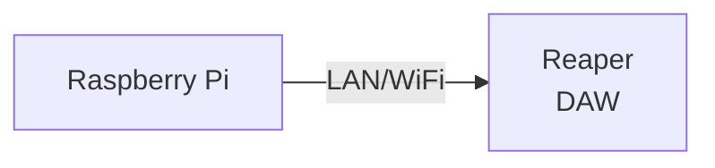
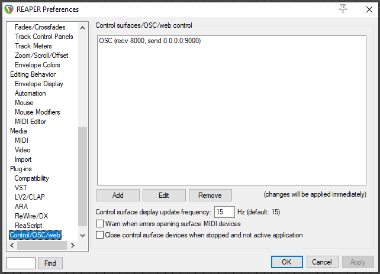
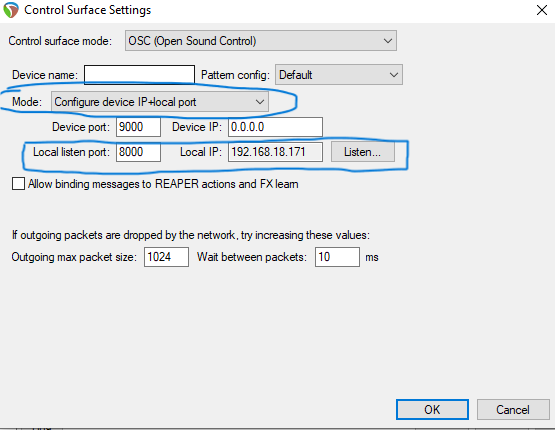
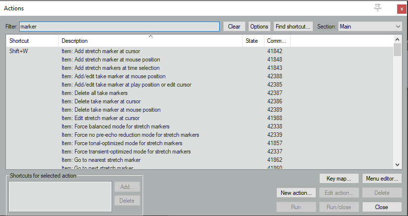
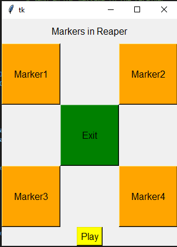

<h1 align="center">
  Backlog 2 Sprint 1
</h1>
<p align="center">

 <i align="center">Using Raspberry Pi to communicate with Reaper Via OSC </i>

</p>

 # Summary:
In this sprint of Backlog 1 , here are the following tasks:


1.  Preparing and Configuring Reaper for OSC
2.  Pi to Reaper Communication

# System Flowchart



# Reaper Side Configuration
<details><summary><b>Show Reaper Preparation & OSC Configuration</b></summary>


# Installing Reaper:
Please Click [here](https://www.reaper.fm/download.php) to install Reaper

## Configuration (Reaper)

1. Go to **Reaper Preference** using the shortcut `Ctrl+P`
2. Navigate to **Control/OSC/Web** (blue highlight)
3. Click on `Add` to configure a new OSC device 



*Reaper Preference Windows*

4. Configure new **OSC Device** as shown in the picture below<br>



*Makse sure MODE is: `Configure device IP+local port`*<br>
*Change only thee `Local Listen Port` & `Local IP`*


## Identifying OSC Commands in Reaper

In this tutorial, we are using the *Action List* in **Reaper**. In Reaper, the *Action List* is a comprehensive catalogue of commands and functions that you can execute within the softwaer. It covers basic features such as playback controls to complex scripting operations. 

To view *Action List* navigate to `Actions -> Show action list...`

Look out for `Command ID` (right click to unhide)<br>



## Configuration (Raspberry Pi)

1. Create a directory folder for the required python files. In this particular case, we are going to name the folder *reaper*.

```
mkdir reaper
```

2. Please copy the following files into the folder directory `~/reaper`

```
lisagui.py
```

3. Go to the directory `reaper`

```
cd ~/reaper
```

4. Edit the *IP Address* of the *Laptop (running Reaper)* in the respective python files

- Line 23 of `lisagui.py`
```
PI_A_ADDR = "10.10.10.10"
```

5. Run the python files `lisagui.py` (please ensure you have configured marker 1 in Reaper). If the script is executed successfully, it will play/stop the playback on reaper.

```
python3 lisagui.py
```



</details>
 