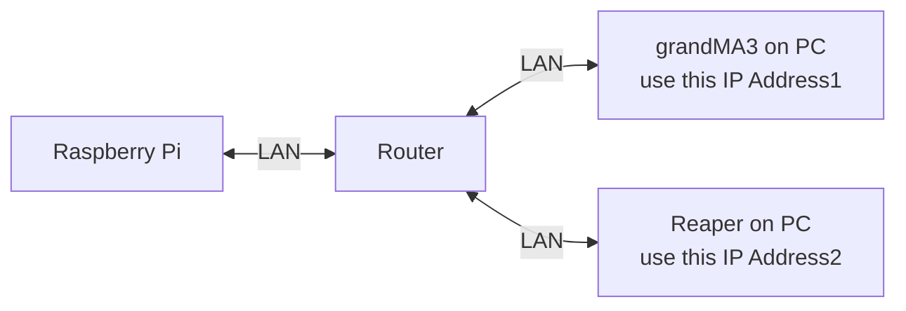

# Tutorial_for_MA3_Control_via_Python_OSC
Here we are trying to control "GrandMA3" via "Python OSC" to fire the Lighting Sequences for our game

The resources in this tutorial are tested with the following hardware
1. Computer running **grandMA3 onPC (Version)** and **Reaper**
2. **grandMA3 onPC CommandWing**
3. **Raspberry Pi4 with python OSC**

## System Flowchart

## Configuration guide for grandMA3 onPC
Please download [grandMA3](https://www.malighting.com/downloads/products/grandma3/) on PC if you haven't
<br>
<br>

Please refer to the **setup guide** for instructions specific to configuring **OSC control** on the **grandMA3 onPC software**.

[setupguide_link](./GrandMA3_OSC_setupguide.pdf)


## OSC Support on grandMA3
For more instruction in **OSC for grandMA3**, please refer to this [link](https://help2.malighting.com/Page/grandMA3/remote_inputs_osc/en/1.8).


## Configuration (Reaper)
Follow The tutorial for OSC to Reaper [Here](https://github.com/tl0wh/EGL314_Team-A_Project-Repository/blob/main/Backlog%202%20Sprint%201/Backlog2Sprint1.md)


## Installation / Operation
In this example, we will be using a **Raspberry Pi** to control **grandMA3 on PC**. and **Reaper**.

1. Create a file directory (in this example we will call the folder `team_ctrl`)
```
mkdir team_ctrl
```

2. Copy the respective python file into the folder `~/team_ctrl`
```
guiPage1.py
guiPage2.py
guiPage3.py

```

3. Edit the **IP Address(1) and Port Number(1)** (`line 18 and 19`) of the **computer** running **grandMA3 on PC** in `guiPage3.py`
```
LAPTOP_IP = "192.168.0.100"		
PORT = 8000                    
```

 4. Edit the **IP Address(1)**I of the **Laptop (running Reaper)**in the respective python files

 - Multiple Lines of `guiPage2.py`
```
PI_A_ADDR = "10.10.10.10"
```


5. Identifying OSC Commands in Reaper

- Refer Back to [Backlog 2 Sprint 1](https://github.com/tl0wh/EGL314_Team-A_Project-Repository/blob/main/Backlog%202%20Sprint%201/Backlog2Sprint1.md) for OSC Configuration
<br>


6. Execute `guiPage1.py`. If the file is executed successfully, The Stored Sequence on the MA will Go , marker on Reaper will also jump accordingly.
```
python3 guiPage1.py
```