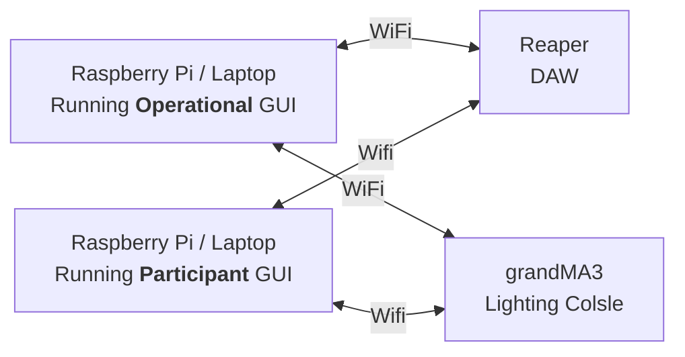
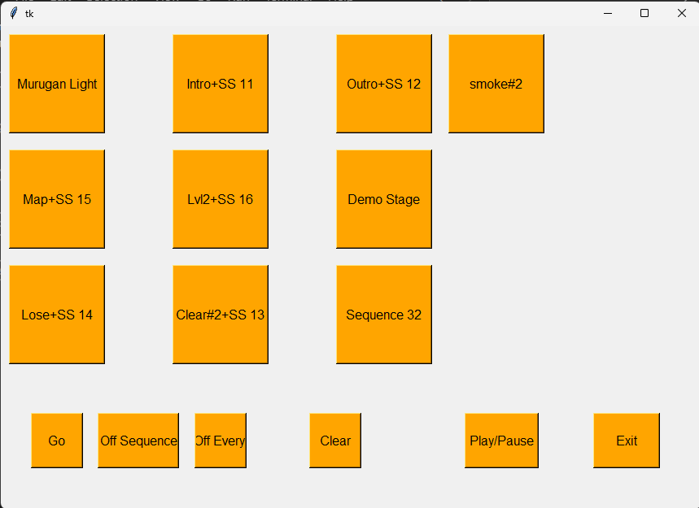
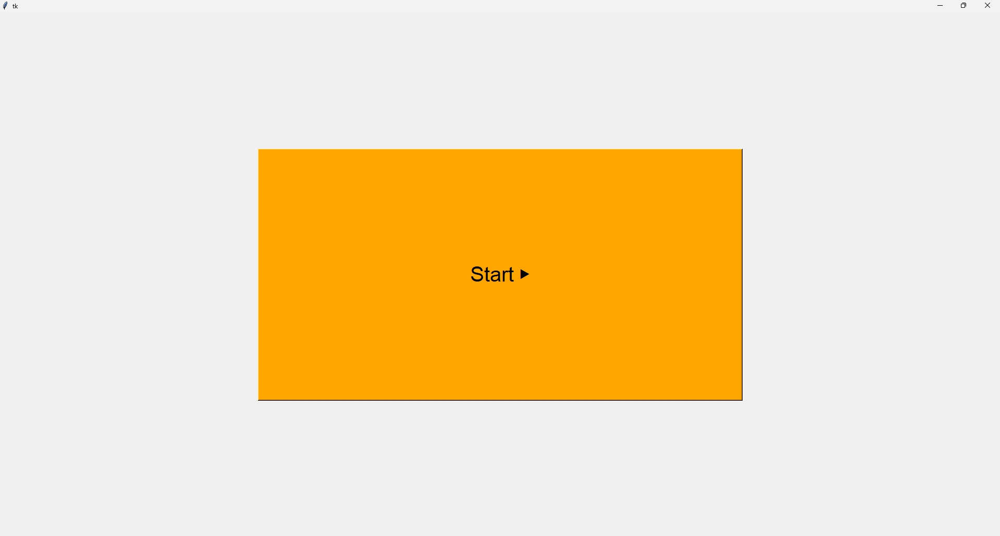
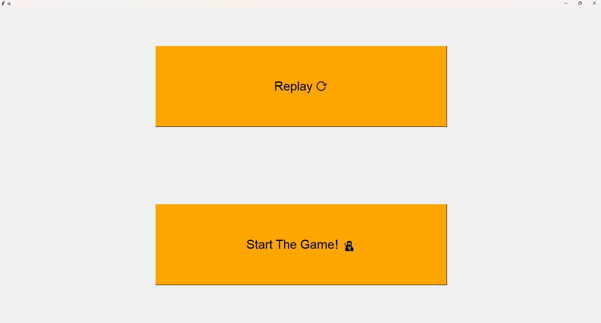
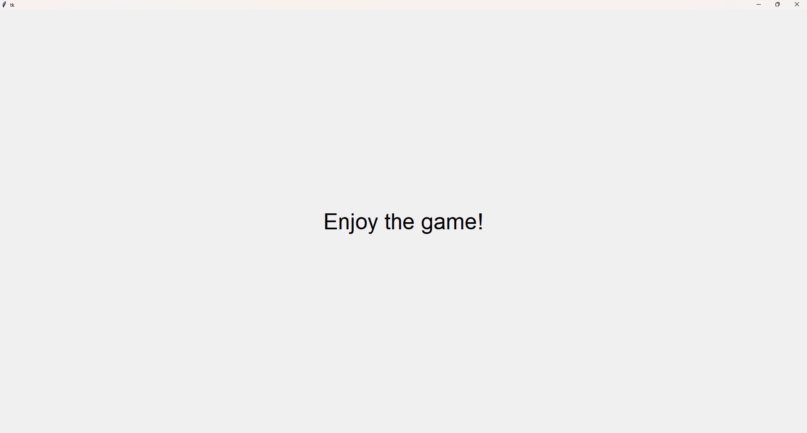
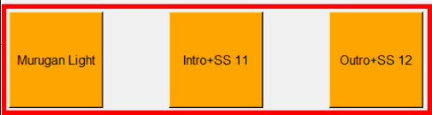
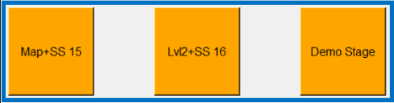

<h1 align="center">
  Minimum Viable Product 
</h1>

<p align="center">

 <i align="center">Minimum Viable Product Presentation for The BlindFold Challenge ( Team A ) </i>
</p>

<h2 align="center">
  Operational Guide for GUIs in Game
</h2>
<b>This Section Requires [Reaper](https://github.com/tl0wh/EGL314_Team-A_Project-Repository/blob/main/Backlog%202%20Sprint%201/Backlog2Sprint1.md) and [MA3](https://github.com/tl0wh/EGL314_Team-A_Project-Repository/blob/main/Backlog%201%20Sprint%201/GrandMA3_OSC_setupguide.pdf) OSC Configuration to be done</b>
In this game , there will be <u><b>2</b> GUIs.</u><br>
<b>Note that: 1 Laptop has to be deployed for Each GUI</b>

<h2 align="center">
  System Layout for this Specific Section
</h2>


<h3>1. Master GUI for Operational Team <br></h3>
 <br>
<h3>2. GUI for Participant<br></h3>
 <br>
 <br>
 <br>

## Breaking Down Operational GUI:


### This is the Master GUI.<br> Each button will be tied to 2 different functions;<br> 1 to fire sequences in MA3<br> 1 to fire Audio in Reaper
## Components
### - In the <u>Red</u>
</img>
- `Murugan Light`<br>
-Bring Guests to our Station
- `Intro` <br>
-Voiced Over Game Introduction
- `Outro` <br> 
-Voice Over Concluding Station

### - In the <u>Blue</u>
</img>
- `Demo Stage`<br>
-Demonstration Level of Game
- `Map`<br>
 -Level 1 Easy Stage of Game
- `Lvl2`<br>
 -Level 2 Hard Stage of Game

### - In the <u>Green</u>
</img>
- `Lose`<br>
-Fired when Ninja 1 <b>Loses</b>

- `Clear`<br>
-Fired when Ninja 1 <b>Advances</b>


- `Sequence 32`<br>
-Spare Function

### - In the <u>Yellow</u>
</img>
- `Go`<br>
-Go to <b>Next Cue</b> in MA3

- `Off Sequence`<br>
-Off All<b> Active Running Sequences</b> in MA3

- `Off Everything`<br>
-Off All<b> Active Running Sequences</b> in MA3<br>
-Stops <b>Audio Playback</b> in Reaper

- `Clear`<br>
-Clear All <b>Running Presets</b> in MA3


- `Play/Pause`<br>
-Toggle <b>Audio Playback</b> in Reaper

## --Breakdown of Operational GUI is Now Complete--
<br>
<br>

## Breaking Down Participant GUI:
### This is Participant GUI<br> They Can Fire the Intro & Start the Easy Level from This GUI<br><br>Each button is also tied to 2 different functions;<br> 1 to fire sequences in MA3<br> 1 to fire Audio in Reaper
## Components:

### - In the Start Page
</img>
- `Start`<br>
-Starts Introduction 

### - In the Main Page
</img>
- `Replay`<br>
-Replays Introduction
- `Start The Game!`<br>
-Starts Level 1 Easy Stage of Game

### - In the Ending Page
</img>

## --Breakdown of Participant GUI is Now Complete--

### Now We Will look at the Codes behind both GUI Buttons

## Understanding what it does
* Here is a reference code taken from [Mastergui.py](./Mastergui.py)
Line 223:
```
def seq26():

     # REAPER
    PI_A_ADDR = "192.168.254.30"		# wlan ip
    PORT = 8000

    addr = "/action/41256" # Jump to Marker
    msg = float(1) # Trigger TRUE Value
    addr2 = "/action/1007" # Play/Stop Function in Reaper
    msg = float(1) # Trigger TRUE Value

    send_message1(PI_A_ADDR, PORT, addr, msg)
    send_message3(PI_A_ADDR, PORT, addr2, msg)


    #MA3
    if __name__ == "__main__":
        LAPTOP_IP = "192.168.254.229"		# send to laptop w grandMA3
        PORTS = 8888   # laptop w grandMA3 port number
        addrs = "/gma3/cmd"


        send_message2(LAPTOP_IP, PORTS, addrs, "Off MyRunningSequence")
        send_message2(LAPTOP_IP, PORTS, addrs, "Go Sequence 26")

    print("This is sequence 26")
```
### This is how we are able to get 1 button to send OSC Messages to 2 different Softwares<br>

### Important Things to Note / Edit:
1. In lines as shown below, make sure both the `IP Address` and `Port Number` Reflect in `Reaper`.<br>
Commands can be changed after the `/action/******`<br>
A Full Tutorial for Reaper OSC & Commands can be found [here](https://github.com/tl0wh/EGL314_Team-A_Project-Repository/blob/main/Backlog%202%20Sprint%201/Backlog2Sprint1.md)<br>


```
#Reaper IP & Port
PI_A_ADDR = "192.168.254.30"		# wlan ip 
PORT = 8000
addr = "/action/41256" # Jump to Marker
msg = float(1) # Trigger TRUE Value
```


2. In lines as shown below, make sure both the `IP Address` and `Port Number` Reflect in `grandMA3`.<br>
Fuction can be changed in  `send_message2()`, specifically  `addrs, "ENTER DESIRED MESSAGE"`<br>
A Full Tutorial for grandMA3 OSC & Commands can be found [here](https://github.com/tl0wh/EGL314_Team-A_Project-Repository/blob/main/Backlog2Sprint2/Setup_For_MA3/GrandMA3_OSC_setupguide.pdf)<br>

```
 LAPTOP_IP = "192.168.254.229"		
 PORTS = 8888   # laptop w grandMA3 port number
 addrs = "/gma3/cmd
 send_message2(LAPTOP_IP, PORTS, addrs, "Off    MyRunningSequence")
```

### Therefore, this is how you can edit the codes to perform other command / functions in Reaper / GrandMA3
##