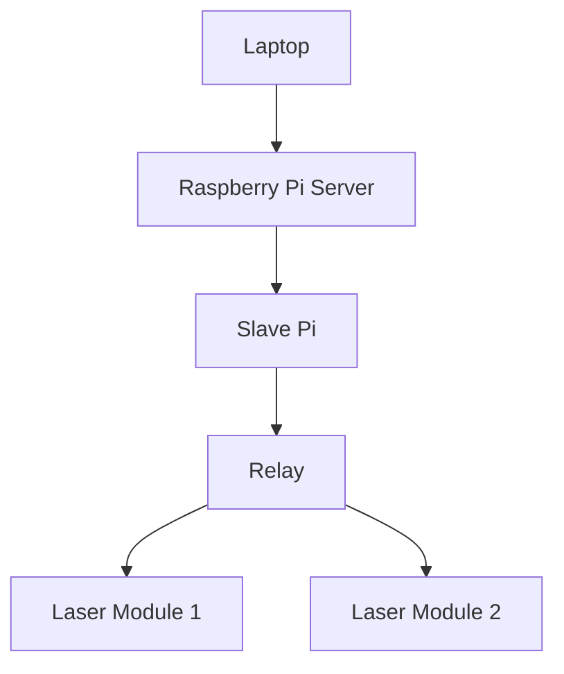
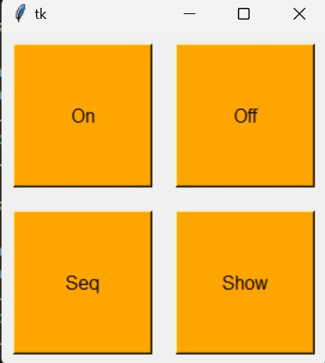

# EGL 314 Laser tutorial

Laser

## 
#  System Flowchart 


##
# Hardware
1. 5 Raspberry Pi
2. 24 Laser Modules
3. 12 Relay
4. Laptop
##
# Software for connecting the server

1. Copy the file osclaser_server.py into your raspberry pi.

2. In the osclaser_server.py change the IP address to your IP and your port
```
# change the receiver_ip value to your RPi's IP address
receiver_ip = "IP Address" # Team A
receiver_port = 2000
```

3. In the osclaser_server.py also change the IP address to all the IP addresses of the respective Slave Pi
```
    if 1 <= spk <= 3:
       send_addr = "IP Address" #Team C
       send_port = 2001
    elif 4 <= spk <= 6:
      send_addr = "IP Address" #Team E
      send_port = 2002
    elif 7 <= spk <= 9:
      send_addr = "IP Address" #Team B
      send_port = 2003
    elif 10 <= spk <= 12:
      send_addr = "IP Address" #Team F
      send_port = 2004
```

4. Run your server
```
python3 osclaser_server
```

### You have completed server setup
##
# Gui tutorial

1. Download the whole Laser_Modules file into your laptop
2. On your laptop RUN the GUI

3. Upon pressing "On" or "Off" it will turn all the laser on or off
4. Upon Pressing "Seq" it will display a laser show 
5. Upon pressing "Show" it activates the Reaper(which can be learned more about in MVP.md) to play a music, it shows the same laser sequence as "Seq" and it also shows a light show on the Neopixel(This can be learned more about in Neopixel.md)

### You have learned how the Gui works
##
# Code explanation
 Upon sending a message, it will always send a line with 3 different numbers
 ```
    msg =[
        "11, 1, 0",
 ```
 Well what do this numbers mean?

 The first number signifies which Relay it is about to control
 ```
    msg =[
        "11,
 ```

 The Second number signifies which laser it will control ( 1 or 2 because the relay has only 2 Channels )
 ```
    msg =[
        "11, 1
 ```
 The Third number siginifies whether the laser will turn on or off. 1 Being on and 0 being off
```
    msg =[
        "11, 1, 0",
```

### You have completed code explanation
##
# Congrats you have completed Laser.md