<h1 align="center">
  Minimum Viable Product
</h1>

<p align="center">

 <i align="center">Minimum Viable Product Presentation for The BlindFold Challenge ( Team A ) </i>
</p>

# System Flowchart (Main Setup)
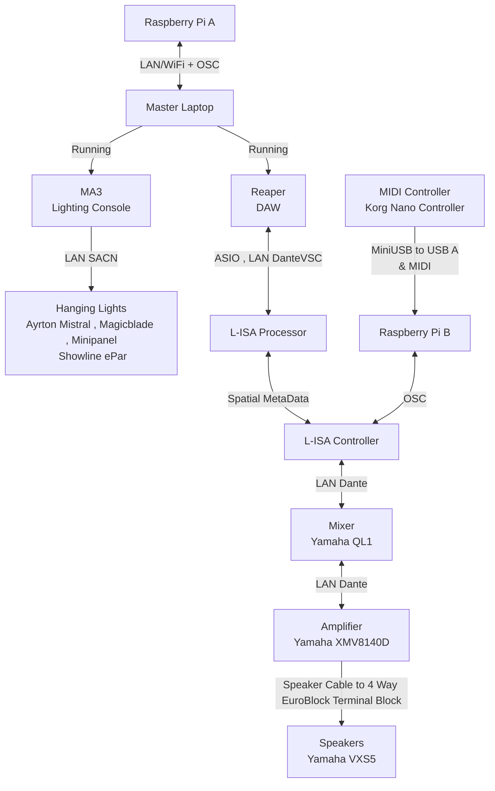
# System Flowchart (NeoPixel Setup)
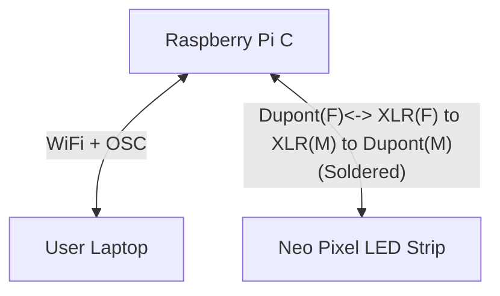
## Asset Files:
There will be the Following Files ; Lighting MA3(.show)<br> SoundScape  L-ISA Controller(.lisa)<br>Digital Audio Workstation Reaper(.rpp) ShowFiles<br> Located in Asset_Files in [MVP](./Asset_Files/)
<br>
<br>
As for Audio files, It is all located inside [Audio_files\Sfx](./Audio_Files/) Folder<br>
To be imported into Reaper

### Required Software:
- [Reaper DAW](https://www.reaper.fm/download.php)
- [grandMA3 on PC](https://www.malighting.com/downloads/products/grandma3/) (If you have a console , this is optional)
- [L-ISA Controller](https://www.l-acoustics.com/products/l-isa-studio/)
- L-ISA Processor (Installed with L-ISA Controller)
- [Dante Virtual Soundcard](https://my.audinate.com/support/downloads/dante-virtual-soundcard)
- [Dante Controller](https://my.audinate.com/support/downloads/dante-controller)
- [LoopMIDI](https://www.tobias-erichsen.de/software/loopmidi.html)(Needed to Link Reaper Timecode into L-ISA)

# Configuration
## Setting up for Reaper and grandMA3 (OSC)
- Tutorial for [Reaper](https://github.com/tl0wh/EGL314_Team-A_Project-Repository/blob/main/Backlog%202%20Sprint%201/Backlog2Sprint1.md)
- Tutorial for [grandMA3](https://github.com/tl0wh/EGL314_Team-A_Project-Repository/blob/main/Backlog%201%20Sprint%201/Backlog1Sprint1.md)
## Setting Up L-ISA 
1. Open L-ISA Processor
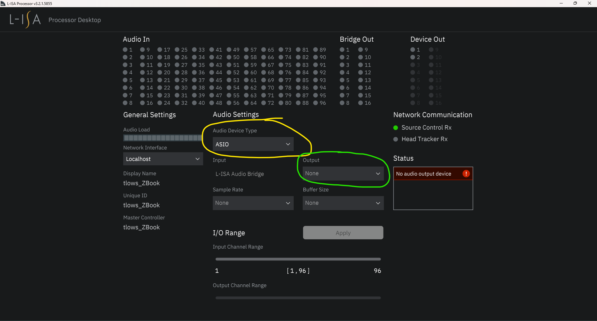
2. Under `Audio Device Type` Select `ASIO` (Yellow)
3. Under `Output` Select `Dante VSC`
4. Open up L-ISA Controller
5. Go to `Processors` (Top Right Green )
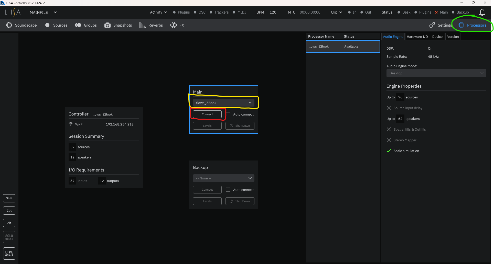
6. Go to `Main` , Select your `Laptop Name` (Yellow)
7. Select `Connect` (Red)
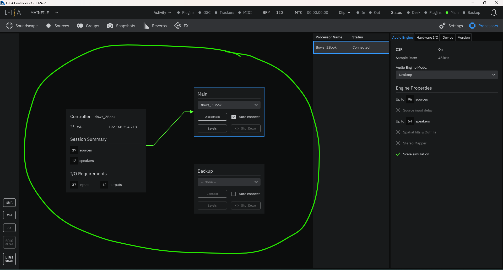
8. After Connecting successfully, there will be a green arrow (Green)
9. Note that at the extreme top right , `Main` will change from a `Cross (Error)` to a `Green Dot (Online)`
## Setting up of L-ISA is Done


## Linking MIDI From Reaper to L-ISA Controller:
1. Launch LoopMIDI
2. Rename your New Profile(Yellow)
3. Click + (Green)
4. Appears Saved (Blue)
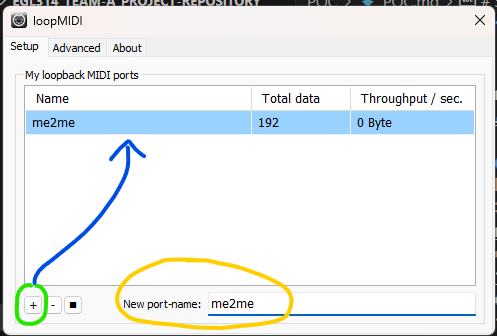

## Reaper Side
1. Launch Reaper
2. `Control + P` to go Preferences
3. Navigate to MIDI
4. Under  , Enable Output for your LoopMidi Profile
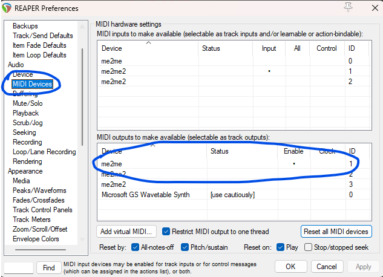
5. Select the Timecode Track in the MasterFile<br>
6. Navigate to the Fader at the `bottom` Corresponding to your source.
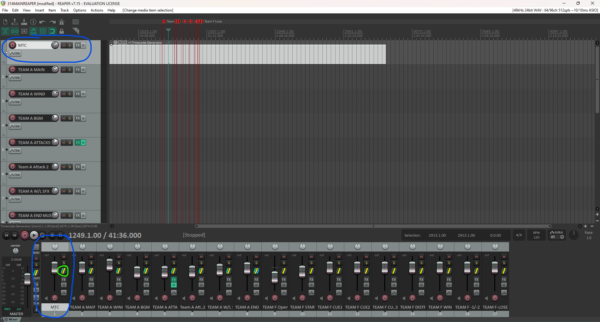
7. Click the button Circled in Green
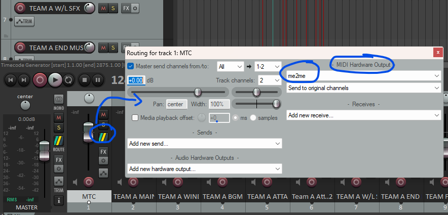
8. Navigate to `MIDI Output Device`
9. Select the MIDI Profile you have just created in `LoopMIDI`

## L-ISA Side
1. Open L-ISA Controller
2. Navigate to Settings at the Top Right

3. Go To MIDI Tab
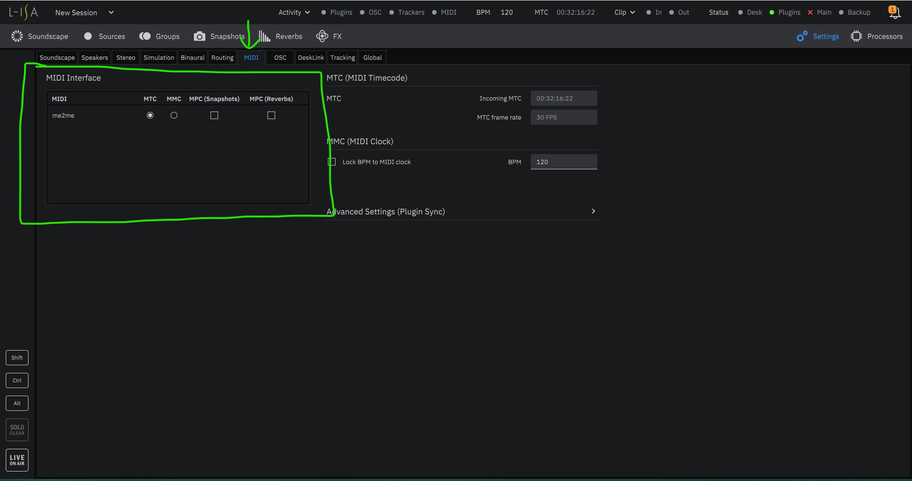
4. Click MTC For your saved MIDI Profile
5. Head Back to Reaper and Press Play
6. Timecode at the top right will change away from 00:00:00:00
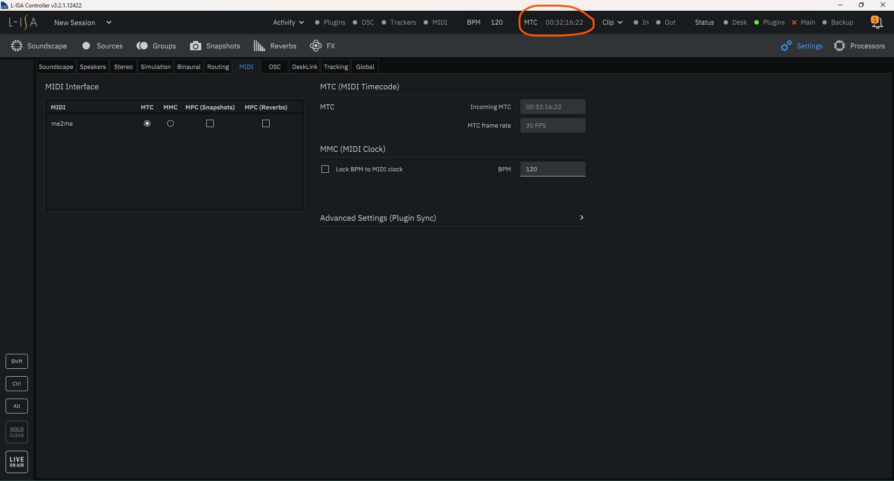

## -Timecode Configuration is Now Complete-

## Configuring & Using MIDI Controller into L-ISA Controller Via OSC:
### L-ISA Side
1. Open L-ISA Controller
2. Navigate to `Sources` ( Red Top Left )
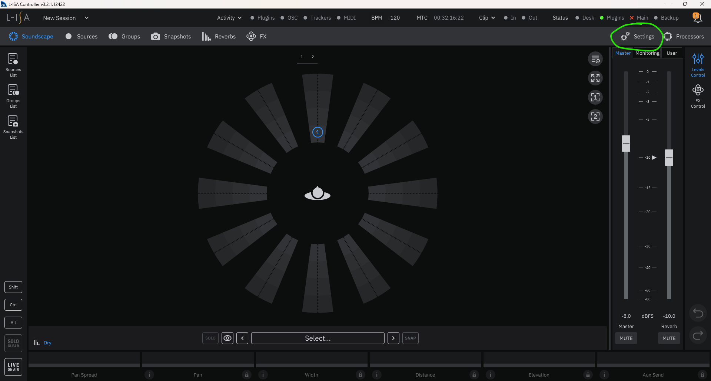
3. Find the Source that is being controlled by the MIDI Controller.(In this case , 1)
4. Look for `Ext OSC` ( Red )
5. Select the `P , W , D , E , S` attribute ( Green ) 
-----------------------------------------------------
6. Go To `Settings` (Green)
7. Select `OSC` Tab ( Yellow )
8. Select `New` ( Orange )
9. Enter `Device Name` , `IP Address` & `Port Number` ( Blue )
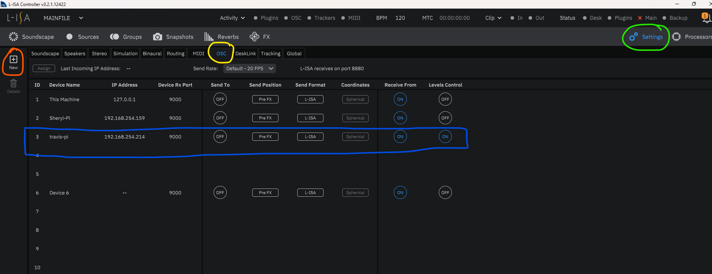

10. Make sure `Receive From` & `Levels Control` is On.

### Raspberry Pi Configuration
1. Create a file directory (in this example we will call the folder `MIDI`)
```
mkdir MIDI
```

2. Copy the respective python file into the folder `~/MIDIl`
```
fader.py
```


3. Edit the **IP Address and Port Number** (`line 43 and 44`) of the **computer** running **L-ISA Controller** in `fader.py`<br>
(This is <b>Important</b> becuase this is how the Raspberry Pi sends MIDI Data via OSC into L-ISA Controller. <b>A Crucial Part of Our Game</b>)
```
LAPTOP_IP = "192.168.254.30"		
PORT = 8880                
```
( Note that L-ISA Controller Port Number is Always `8880`) <br>


4. Execute `fader.py`.<br> If the file is executed successfully; Turning the Configured Knob on the MIDI Controller will make the Source 1 `pan` in L-ISA Controller
```
python3 fader.py
```


## -MIDI Controller to L-ISA Configuration is Now Complete-


