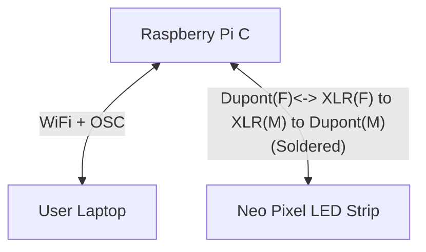

# System Flowchart (NeoPixel Setup)


### Required Equipment:
- Raspberry Pi
- Neopixel Strip
- Jumper wires
- A Laptop

## Hardware Connections


### Connection

    (Raspberry Pi --> Neopixel)
    GPIO pin 18 --> Control 
    Ground Pin  --> Ground
    5V          --> Power

## Software

1. Turn on Raspberry PI

2. Make sure the to configure the Raspberry Pi date to the current date

    ```
    sudo date -s 'YYYY-MM-DD HH:MM:SS'    
    ```
3. Open the terminal and paste this
    ```
    sudo pip3 install rpi_ws281x   
    ```
    ```
    sudo pip3 install adafruit-circuitpython-neopixel  
    ```
    ```
    sudo python3 -m pip install --force-reinstall adafruit-blinka
    ```
4. Turn off dtparam
    ```
    /boot/config.txt
    ```
    Change "dtparam=adio=on" to off
    ```
    dtparam=audio=off
    ```
5. Create the file Server.py, paste Serverupdated.py in it and run it
    ```
    sudo python3 Serverupdated.py
    ```
6. In serverupdated.py change the IP address to your IP and choose a Port
    ```
    # OSC server setup
    receiver_ip = "192.168.254.242"  # Change to your RPi's IP address
    receiver_port = 2005
    ```
7. Open your laptop and Run visual studio code
8. Download Client.py
9. In Client.py change the IP address to your Pi's address and port( The same that you did in #6)
    ```
    # FOR INFO: IP address and port of the receiving Raspberry Pi 
    PI_A_ADDR = "192.168.254.242"  # Change to your RPi's IP address
    PORT = 2005
    ```

## -Neopixel control through open sound command is now complete-

