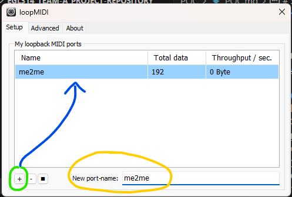
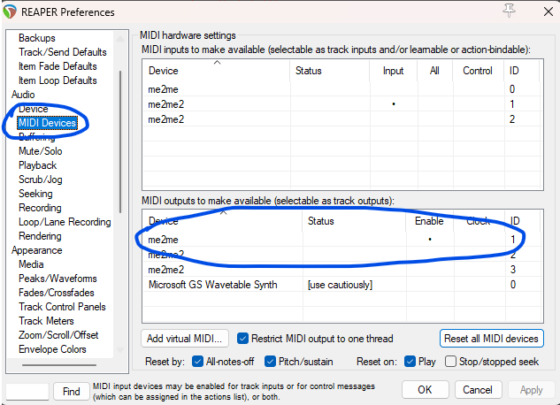
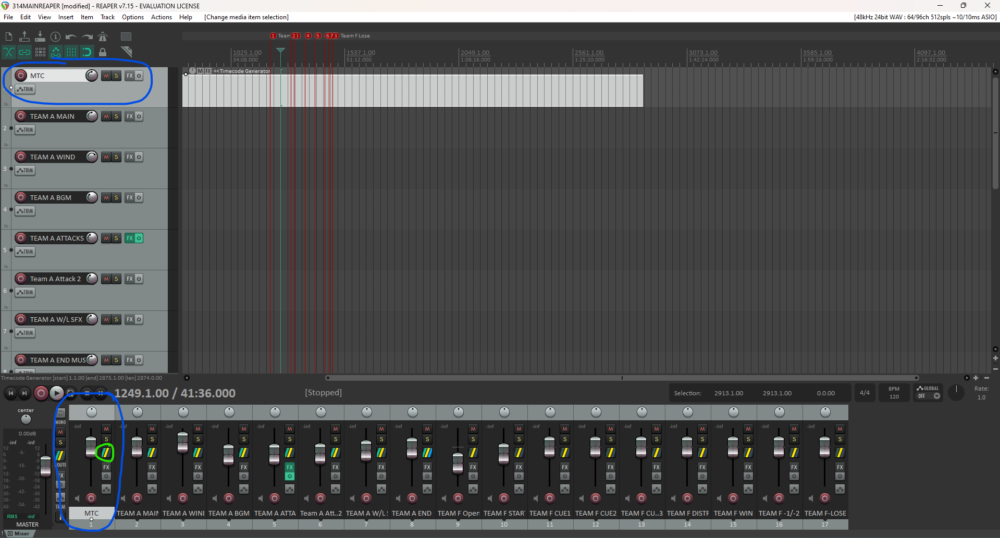
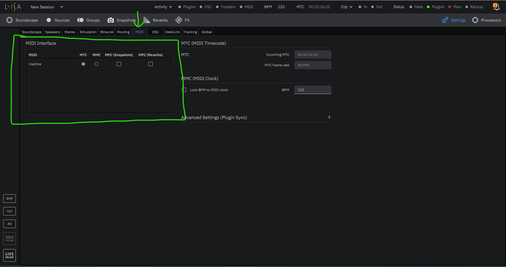
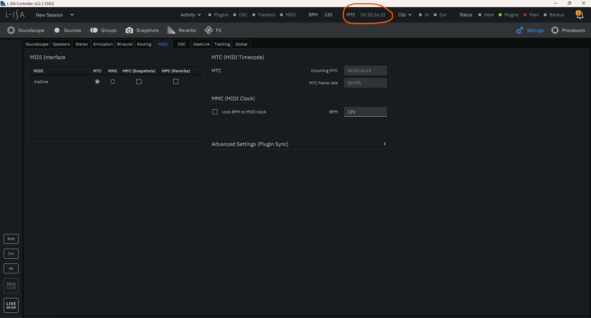

<h1 align="center">
  Proof Of Concept 
</h1>

 <i align="center">Proof Of Concept for The BlindFold Challenge ( Team A ) </i>

# System Flowchart

## Asset Files:
There will be the Following Files ; Lighting MA3(.show)  SoundScape  L-ISA Controller(.lisa) Dightal Audio Workstation Reaper(.rpp) ShowFiles  Located in Asset_Files in [POC](./Asset_Files/)

### Required Software:
- [Reaper DAW](https://www.reaper.fm/download.php)
- [grandMA3 on PC](https://www.malighting.com/downloads/products/grandma3/) (If you have a console , this is optional)
- [L-ISA Controller](https://www.l-acoustics.com/products/l-isa-studio/)
- L-ISA Processor (Installed with L-ISA Controller)
- [Dante Virtual Soundcard](https://my.audinate.com/support/downloads/dante-virtual-soundcard)
- [Dante Controller](https://my.audinate.com/support/downloads/dante-controller)
- [LoopMIDI](https://www.tobias-erichsen.de/software/loopmidi.html)(Needed to Link Reaper Timecode into L-ISA)

# Configuration

## Linking MIDI From Reaper to L-ISA Controller:
1. Launch LoopMIDI
2. Rename your New Profile(Yellow)
3. Click + (Green)
4. Appears Saved (Blue)

## Reaper Side
1. Launch Reaper
2. `Control + P` to go Preferences
3. Navigate to MIDI
4. Under  , Enable Output for your LoopMidi Profile

5. Select the Timecode Track in the MasterFile
6. Navigate to the Fader at the `bottom` Corresponding to your source.

7. Click the button Circled in Green

8. Navigate to `MIDI Output Device`
9. Select the MIDI Profile you have just created in `LoopMIDI`

## L-ISA Side
1. Open L-ISA Controller
2. Navigate to Settings at the Top Right

3. Go To MIDI Tab

4. Click MTC For your saved MIDI Profile
5. Head Back to Reaper and Press Play
6. Timecode at the top right will change away from 00:00:00:00

## -Timecode Configuration is Now Complete-

