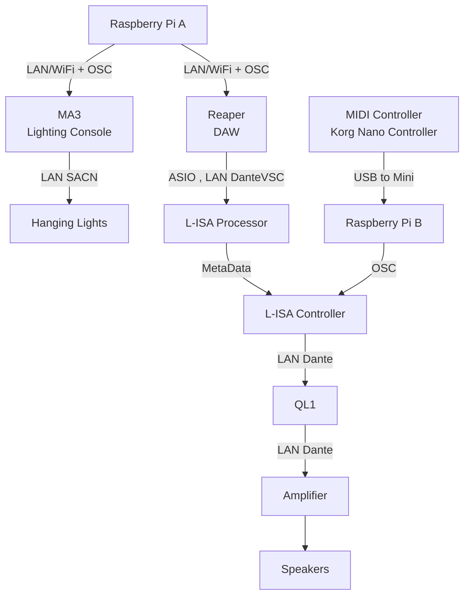

<h1 align="center">
  Proof Of Concept 
</h1>

 <i align="center">Proof Of Concept for The BlindFold Challenge ( Team A ) </i>

# System Flowchart

```mermaid
graph TD
A[Raspberry Pi A ] --LAN/WiFi + OSC--> B[Reaper<br>DAW]
A[Raspberry Pi A ] --LAN/WiFi + OSC --> C[MA3<br> Lighting Console]
C[MA3<br> Lighting Console] --LAN SACN--> D[Hanging Lights]
B[Reaper<br>DAW] --ASIO , LAN DanteVSC--> E[L-ISA Processor]
E[L-ISA Processor] --MetaData--> F[L-ISA Controller]
F[L-ISA Controller] --LAN Dante--> G[QL1]
G[QL1]--LAN Dante--> H[Amplifier]
H[Amplifier] --> I[Speakers]
K[MIDI Controller<br>Korg Nano Controller]--USB to Mini-->J[Raspberry Pi B]
J[Raspberry Pi B]--OSC-->F[L-ISA Controller] 
```

