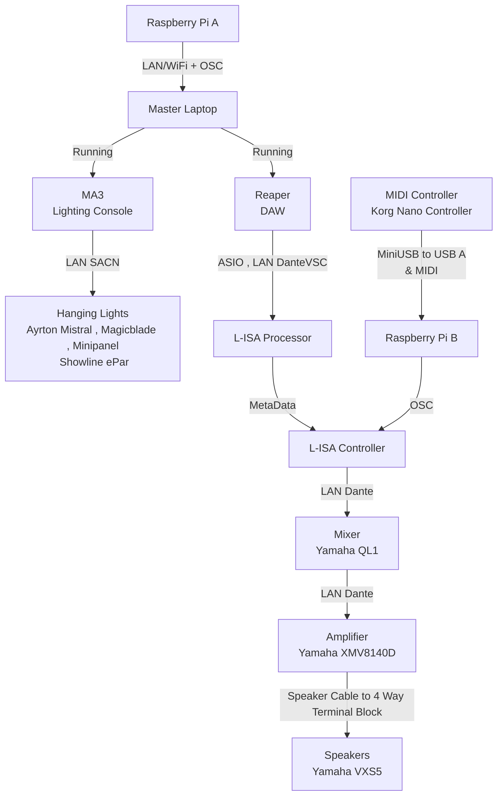

<h1 align="center">
  Proof Of Concept 
</h1>

 <i align="center">Proof Of Concept for The BlindFold Challenge ( Team A ) </i>

# System Flowchart

## Asset Files:
There will be the Following Files ; Lighting MA3(.show)  SoundScape  L-ISA Controller(.lisa) Dightal Audio Workstation Reaper(.rpp) ShowFiles  Located in Asset_Files in [POC](./Asset_Files/)

### Required Software:
- [Reaper DAW](https://www.reaper.fm/download.php)
- [grandMA3 on PC](https://www.malighting.com/downloads/products/grandma3/) (If you have a console , this is optional)
- [L-ISA Controller](https://www.l-acoustics.com/products/l-isa-studio/)
- L-ISA Processor (Installed with L-ISA Controller)
- [Dante Virtual Soundcard](https://my.audinate.com/support/downloads/dante-virtual-soundcard)
- [Dante Controller](https://my.audinate.com/support/downloads/dante-controller)
- [LoopMIDI](https://www.tobias-erichsen.de/software/loopmidi.html)(Needed to Link Reaper Timecode into L-ISA)

