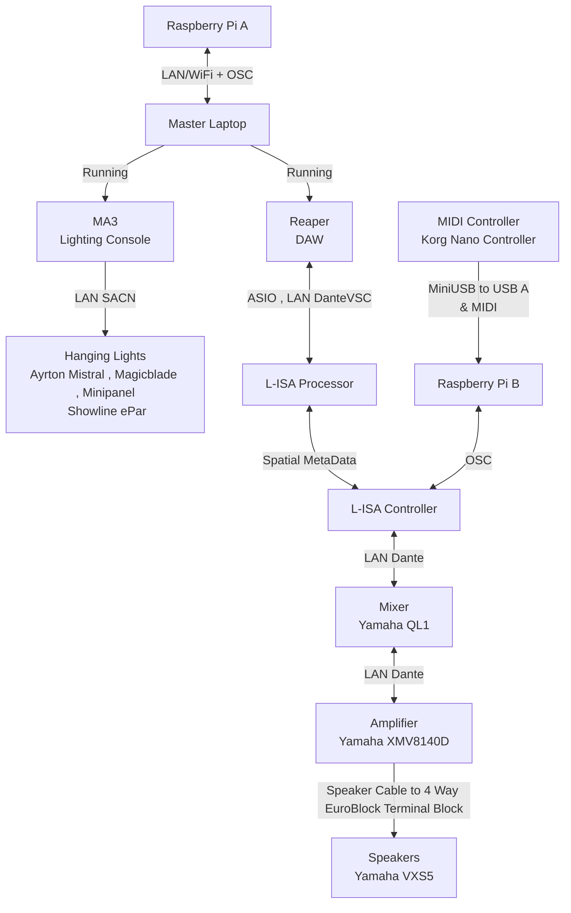

<h1 align="center">
  Project S.O.N.I.C - The Blindfold Challenge
</h1>
<h1 align="center">
  
</h1>

  <i align="center">Train to be a ninja with the use of modern technologies</i>

<h2 align = "center">
  A Project By: 
  
  
  
  

</h2>

  

## Overview
Project S.O.N.I.C (Sensory Observation Ninja Immersive Challenge) is an experiential/exploratory initiative designed to blend the ancient "ninja training techniques" with modern technologies. Students are to design a range of interactive stations that simulate ninja training scenarios, designed to test and enhance your listening abilities, reaction times and strategic thinking. The stations include:
1. Stealth Walking
2. **The Blindfold Challenge** (Team A)
3. Art Of Hearing
4. Reaction Training
5. Memory Sequence
6. Graduation Sequence

  In this repository, the focus will be strictly on Station 2 - The Blindfold Challenge.

## Station 2 - The Blindfold Challenge
The “Blindfold Challenge”, where your vision takes a 
backseat and your ears take the lead 
Participants are blindfolded and must navigate 
through a course guided solely by sounds. 
Participants must avoid contacting obstacles 
placed throughout the course for a successful 
attempt. 

One Person  Blindfolded , 'Ninja Cadet' 
One Person on MIDI Controller guiding  , 'Trainer' 

## Technical Summary

<ul>
  <li>L-Acoustics' L-ISA to provide auditory cues for navigation.</li>
  <li>GrandMA3 Incoporated Lighting as the 'Maze' , Walking through the shadows of the light</li>
  <li>Multi Participant Game. One Blindfolded, the other guiding via a Korg NanoKontrol2 MIDi Controller</li>
</ul>

# System Flowchart

## Asset Files:
There will be the Following Files ; Lighting MA3(.show)  SoundScape  L-ISA Controller(.lisa) Dightal Audio Workstation Reaper(.rpp) ShowFiles  Finalised files are located in Asset_Files in [Final](./Final_Presentation/Asset_Files/)

### Required Software:
- [Reaper DAW](https://www.reaper.fm/download.php)
- [grandMA3 on PC](https://www.malighting.com/downloads/products/grandma3/) (If you have a console , this is optional)
- [L-ISA Controller](https://www.l-acoustics.com/products/l-isa-studio/)
- L-ISA Processor (Installed with L-ISA Controller)
- [Dante Virtual Soundcard](https://my.audinate.com/support/downloads/dante-virtual-soundcard)
- [Dante Controller](https://my.audinate.com/support/downloads/dante-controller)
- [LoopMIDI](https://www.tobias-erichsen.de/software/loopmidi.html)(Needed to Link Reaper Timecode into L-ISA)

## Tutorials:
- **[Backlog 1 Sprint 1](./Backlog%201%20Sprint%201/Backlog1Sprint1.md)** - OSC Installation on Raspberry Pi, Creation of a UI via tkinter, OSC Communication to various devices

- **[Backlog 2 Sprint 1](./Backlog%202%20Sprint%201/Backlog2Sprint1.md)** - OSC Reaper Combined. GUI For Control

- **[Backlog 2 Sprint 2](./Backlog2Sprint2/Backlog2Sprint2.md)** - OSC Reaper & MA3 Combined. GUI For Control

- **[POC](./POC/POC.md)** - Proof Of Concept , Initial Presentation of a Working Gameplay

- **[MVP](./MVP/MVP.md)** - Minimum Viable Project , Refined Gameplay + Introduction of Laser Modules & NeoPixel

- **[Final Presentation](./Final_Presentation/Final.md)** - Final Presentation for Overall Project with Enhanced Quality of Life changes,Code Changes, Added NeoPixel, Reduced Lasers 

## References and Sources:
- **[Huats Club - rpistarterkit](https://github.com/huats-club/rpistarterkit)** - Configuring and preparing a new Raspberry Pi
- **[Huats Club - oscstarterkit](https://github.com/huats-club/oscstarterkit)** - Introductions to Python Open Sound Control for AV
- **[Huats Club - mts_sensor_cookbook](https://github.com/huats-club/mts_sensor_cookbook)** - Basics for Sensors, MIDI Controller.

### Credits
Team A Would like to specially thank, **Mr. Fu YongWei** from **Nanyang Polytechnic** for overseeing our project phase and supplying us with base-source codes.